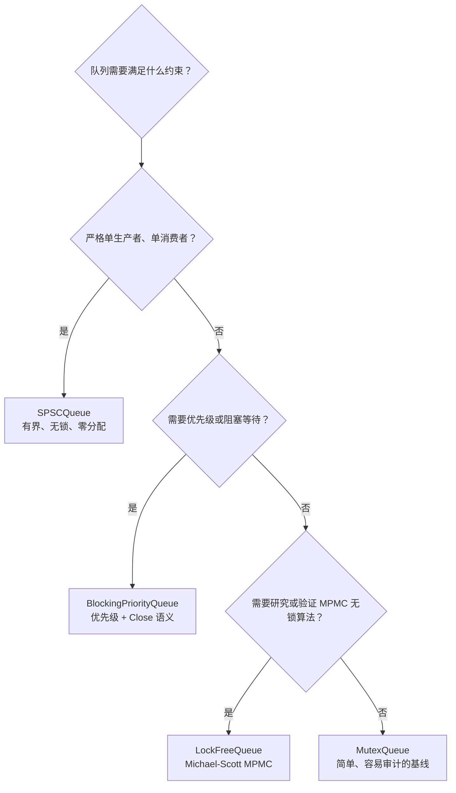
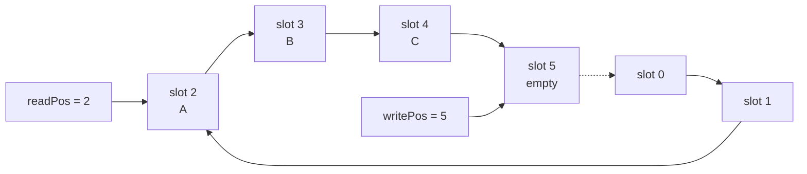
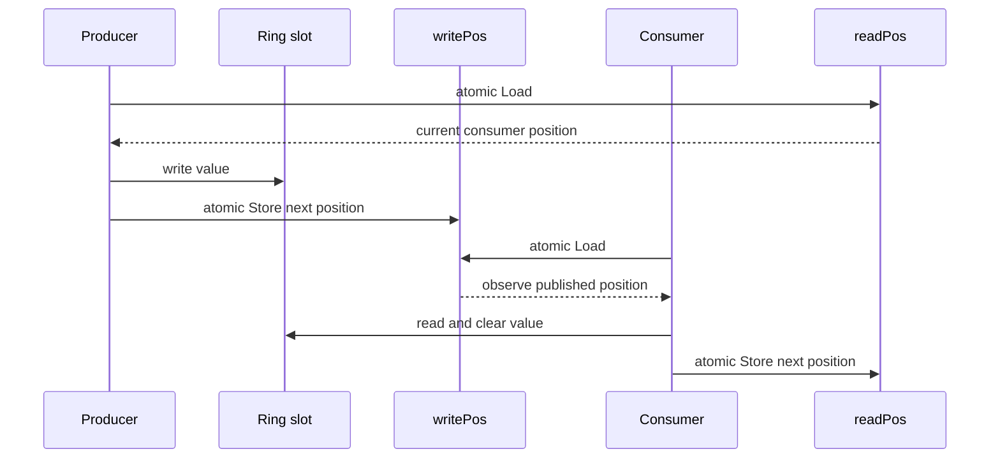
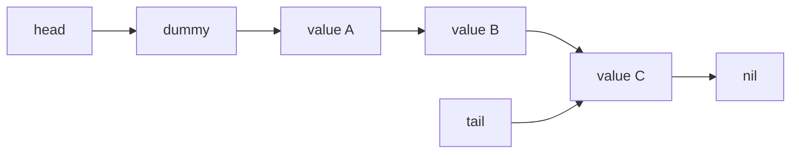
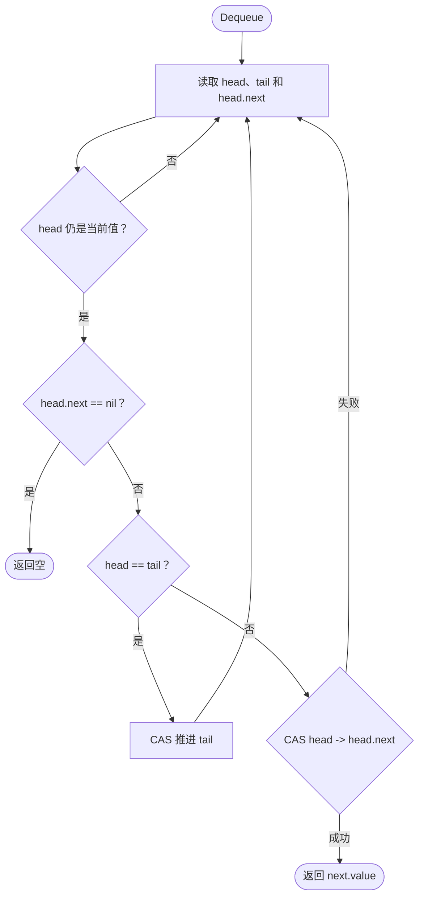
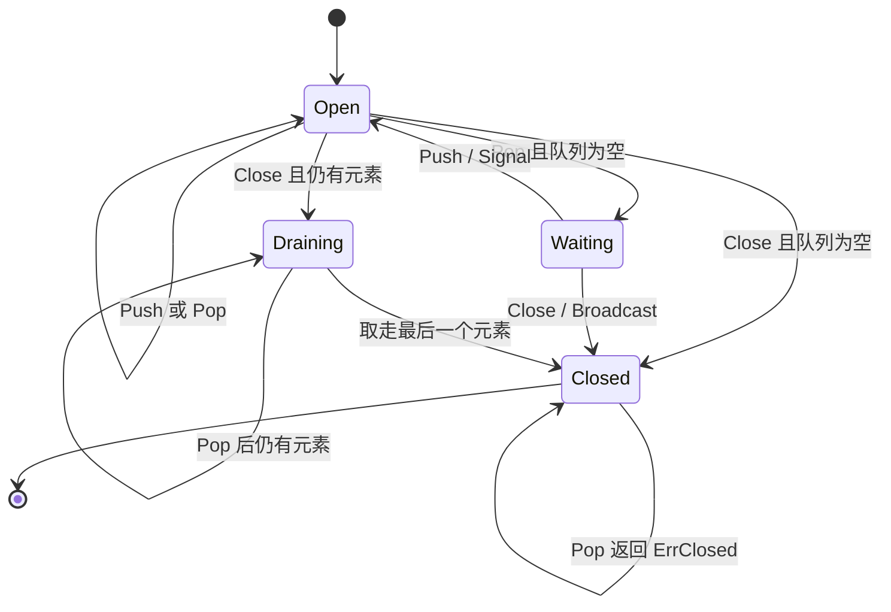

# Concurrent Queue Lab

这个 Go module 用四种队列展示不同的并发设计。重点不是背诵 CAS 模板，而是理解所有权、线性化点、进度保证和退出语义。

## 运行

```bash
go test ./...
go test -race ./...
go test -run TestLockFreeQueueMultipleProducersAndConsumers -count=20
go test -bench=. -benchmem
```

## 实现对比

| 类型                    | 并发模型           | 容量 | 等待方式     | 进度保证  | 适用场景                     |
| ----------------------- | ------------------ | ---- | ------------ | --------- | ---------------------------- |
| `MutexQueue`            | MPMC               | 无界 | `sync.Mutex` | Blocking  | 正确性优先的通用基线         |
| `SPSCQueue`             | 单生产者、单消费者 | 有界 | 非阻塞返回   | Lock-free | 固定数据通道、低分配热路径   |
| `LockFreeQueue`         | MPMC               | 无界 | CAS 重试     | Lock-free | 多生产者、多消费者教学与实验 |
| `BlockingPriorityQueue` | MPMC               | 无界 | `sync.Cond`  | Blocking  | 带优先级的工作分发           |

`MPMC` 表示 multiple producers, multiple consumers；`SPSC` 表示 single producer, single consumer。



## 1. MutexQueue：先建立正确性基线

互斥锁版本把队列状态的所有访问放在同一个临界区中。它最容易验证，也经常是生产代码的合理选择：

```go
var q queue.MutexQueue[int]
q.Enqueue(1)
value, ok := q.TryDequeue()
```

关键点：

- 锁同时保护 Slice Header 和底层元素。
- 出队时把槽位置零，避免引用类型对象被底层数组继续持有；数组容量会保留以供复用。
- 临界区短、竞争低时，Mutex 可能比 CAS 重试更快。
- 它是后续基准的对照组，不是“落后实现”。

## 2. SPSCQueue：用所有权换取简单性

SPSC 环形队列只有两个不断递增的位置：

- Producer 独占 `writePos`，写入槽位后发布新的写位置。
- Consumer 独占 `readPos`，读取槽位后发布新的读位置。
- 数组下标使用 `position & (capacity - 1)`，因此容量必须是 2 的幂。



线性化点是位置的原子 Store：

- 入队先写元素，再 `writePos.Store`，Consumer 看到新位置后才能读取元素。
- 出队先读取并清空元素，再 `readPos.Store`，Producer 看到新位置后才能复用槽位。
- Go 的 `sync/atomic` 操作是顺序一致的，提供这里需要的内存可见性。



限制：同一时间必须恰好只有一个 Producer 和一个 Consumer。这个限制是算法契约，Race Detector 不一定能证明调用者遵守了角色约束。

## 3. LockFreeQueue：Michael-Scott MPMC 队列

MPMC 实现使用带哨兵节点的单链表。`head` 指向当前哨兵，`tail` 指向已知的最后节点：



### 入队

1. 读取 `tail` 和 `tail.next`。
2. 如果 `tail.next != nil`，说明另一个 Goroutine 已链接新节点但尚未推进 `tail`，当前 Goroutine帮助推进它。
3. 使用 CAS 将新节点从 `nil` 链接到 `tail.next`。
4. 尝试推进 `tail`。即使推进失败，入队也已经成功。

成功修改 `tail.next` 的 CAS 是入队的线性化点。


### 出队

1. 读取 `head`、`tail` 和 `head.next`。
2. `head.next == nil` 表示队列为空。
3. `head == tail` 但存在 `next`，说明 `tail` 落后，当前 Goroutine帮助推进它。
4. 使用 CAS 将 `head` 推进到 `next`；`next` 由此成为新的哨兵。

成功修改 `head` 的 CAS 是出队的线性化点。



### 为什么 Go 版本不手工回收节点

C/C++ 无锁链表需要解决 hazard pointer、epoch reclamation 等内存回收问题，否则可能发生 use-after-free 和地址复用导致的 ABA。这个实现依靠 Go GC：只要某个 Goroutine 还持有节点指针，节点就不会被回收和复用。

这降低了教学复杂度，但不代表没有成本：每次入队都会分配节点，GC 压力可能使它输给有界环形队列或 Mutex 版本。

## 4. BlockingPriorityQueue：阻塞和关闭语义

优先队列基于 `container/heap`、`sync.Mutex` 和 `sync.Cond`：

- 数字更大的 Priority 先出队。
- 相同 Priority 按入队 Sequence 保持 FIFO。
- `Pop` 在空队列上等待，不使用忙轮询。
- `Close` 拒绝新 Push，唤醒所有等待者，并允许先排空已有元素。
- 关闭且排空后，`Pop` 返回 `ErrClosed`。

显式关闭很重要。没有关闭协议的阻塞结构会让 Worker 无法可靠退出，也容易在测试和服务停机时泄漏 Goroutine。



## Lock-free 到底意味着什么

Lock-free 不等于：

- 完全没有等待：单个 Goroutine 可能持续 CAS 失败而饥饿。
- Wait-free：本实验没有保证每个操作在有限步骤内完成。
- 一定更快：缓存一致性流量、分配、竞争和重试都可能抵消收益。
- 不需要测试：错误通常只在特定交错顺序下出现。

Lock-free 的含义是：系统整体持续取得进展。即使某个 Goroutine 被暂停，其他 Goroutine 仍有机会完成操作。

## 如何读测试

- `TestSPSCQueueFullEmptyAndWrapAround` 验证有界队列的满、空和下标环绕。
- `TestSPSCQueueConcurrentProducerAndConsumer` 验证单 Producer/Consumer 的顺序与可见性。
- `TestLockFreeQueueMultipleProducersAndConsumers` 使用唯一整数检测重复和丢失。
- Priority Queue 测试验证优先级、同优先级 FIFO、唤醒和关闭后排空。

并发测试只能增加发现错误的概率，不能形式化证明算法正确。深入学习时可以继续加入：

- 不同 `GOMAXPROCS` 和高重复次数测试。
- 随机操作序列与模型对比测试。
- Linearizability checker。
- CPU/Memory Profile 和 mutex/block profile。
- 不同 Producer/Consumer 比例下的吞吐与 P99 延迟基准。

## 基准注意事项

当前 Benchmark 是单 Goroutine 的入队/出队 Round Trip，用来观察基础开销，不代表高竞争性能。比较并发结构时必须固定：

- Producer/Consumer 数量和 CPU 亲和性。
- 队列容量、元素大小和预分配策略。
- 是否允许忙轮询以及可接受的 CPU 占用。
- 吞吐量之外的 P50/P99 延迟和分配次数。
- Go 版本、`GOMAXPROCS`、机器拓扑和测试时长。

不要从一次 `ns/op` 得出“无锁优于锁”的普遍结论。

## 延伸资料

- [The Go Memory Model](https://go.dev/ref/mem)
- [Package atomic](https://pkg.go.dev/sync/atomic)
- [Package container/heap](https://pkg.go.dev/container/heap)
- [Simple, Fast, and Practical Non-Blocking and Blocking Concurrent Queue Algorithms](https://www.cs.rochester.edu/research/synchronization/pseudocode/queues.html)
- [Go Data Race Detector](https://go.dev/doc/articles/race_detector)
