# Concurrent Queue Lab

这个 Go module 用四种队列展示不同的并发设计。重点不是背诵 CAS 模板，而是理解所有权、线性化点、进度保证和退出语义。

## 运行

```bash
go test ./...
go test -race ./...
go test -run TestLockFreeQueueMultipleProducersAndConsumers -count=20
go test -bench=. -benchmem
```

## 实现对比

| 类型                    | 并发模型           | 容量 | 等待方式     | 进度保证  | 适用场景                     |
| ----------------------- | ------------------ | ---- | ------------ | --------- | ---------------------------- |
| `MutexQueue`            | MPMC               | 无界 | `sync.Mutex` | Blocking  | 正确性优先的通用基线         |
| `SPSCQueue`             | 单生产者、单消费者 | 有界 | 非阻塞返回   | Lock-free | 固定数据通道、低分配热路径   |
| `LockFreeQueue`         | MPMC               | 无界 | CAS 重试     | Lock-free | 多生产者、多消费者教学与实验 |
| `BlockingPriorityQueue` | MPMC               | 无界 | `sync.Cond`  | Blocking  | 带优先级的工作分发           |

`MPMC` 表示 multiple producers, multiple consumers；`SPSC` 表示 single producer, single consumer。

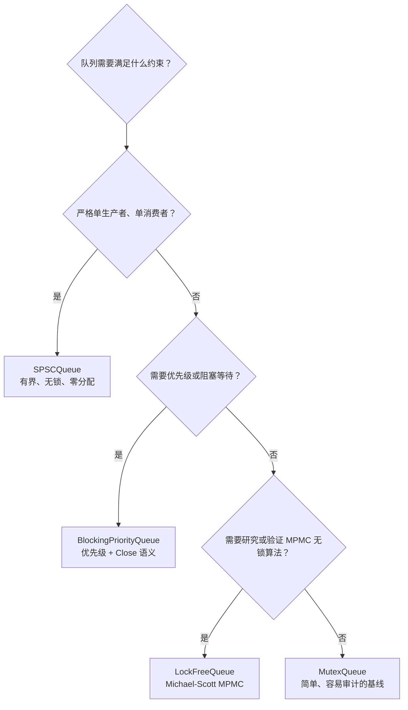

## 1. MutexQueue：先建立正确性基线

互斥锁版本把队列状态的所有访问放在同一个临界区中。它最容易验证，也经常是生产代码的合理选择：

```go
var q queue.MutexQueue[int]
q.Enqueue(1)
value, ok := q.TryDequeue()
```

关键点：

- 锁同时保护 Slice Header 和底层元素。
- 出队时把槽位置零，避免引用类型对象被底层数组继续持有；数组容量会保留以供复用。
- 临界区短、竞争低时，Mutex 可能比 CAS 重试更快。
- 它是后续基准的对照组，不是“落后实现”。

## 2. SPSCQueue：用所有权换取简单性

SPSC 是 Single Producer, Single Consumer 的缩写。它把并发约束变成所有权约束：

- Producer 独占 `writePos`，写入槽位后发布新的写位置。
- Consumer 独占 `readPos`，读取槽位后发布新的读位置。
- 双方都可以读取对方的位置，但绝不会写对方的位置。

因此，推进位置不需要 CAS：不存在第二个 Producer 与当前 Producer 竞争 `writePos`，也不存在第二个 Consumer 竞争 `readPos`。原子操作在这里主要负责跨 Goroutine 的可见性，而不是争夺位置的所有权。

### 2.1 逻辑位置与物理下标

`readPos` 和 `writePos` 是不断递增的逻辑位置，不会在走到数组末尾时归零；真正访问数组时，才把逻辑位置映射成有限范围内的物理下标。

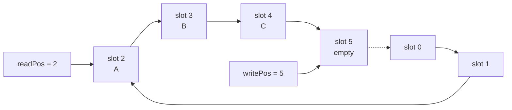

例如容量为 8 时，逻辑位置 `8`、`16` 和 `24` 都映射到物理槽位 `0`。保留不断递增的逻辑位置有两个好处：

- `readPos == writePos` 可以直接表示队列为空。
- `writePos - readPos == capacity` 可以直接表示队列已满。

如果两个位置都在数组末尾归零，那么 `readPos == writePos` 既可能表示空，也可能表示满，还需要额外的状态位来区分。

代码中的满、空判断分别是：

```go
// Producer: 已发布但尚未消费的元素数等于容量，队列已满。
if writePos-q.readPos.Load() == uint64(len(q.slots)) {
    return false
}

// Consumer: 没有 Producer 新发布的位置，队列为空。
if readPos == q.writePos.Load() {
    return zero, false
}
```

位置使用 `uint64`，加减法按模 `2^64` 计算。即使计数器最终溢出，只要 Producer 没有覆盖尚未消费的元素，位置差和下标映射仍能保持一致。实际运行中，每秒十亿次操作也需要数百年才会走完 `uint64` 的范围。

### 2.2 为什么要求容量是 2 的幂

构造函数使用下面的表达式验证容量：

```go
capacity > 0 && capacity&(capacity-1) == 0
```

一个正整数如果是 2 的幂，二进制表示中只会有一个 `1`。减去 1 后，原来的最高位变成 `0`，它右侧的位全部变成 `1`，所以两者按位与的结果一定是 0：

```text
capacity = 8:  1000
capacity - 1:  0111
                  &
               0000  // 是 2 的幂

capacity = 6:  0110
capacity - 1:  0101
                  &
               0100  // 不是 2 的幂
```

`capacity <= 0` 必须单独判断，因为 `0 & (0 - 1)` 也会得到 0，但容量 0 显然不能创建队列。

### 2.3 为什么用 `position & mask` 代替取模

构造时保存：

```go
mask := uint64(capacity - 1)
```

当 `capacity = 8` 时，`mask = 7`，二进制是 `0b111`。表达式 `position & mask` 只保留位置的低 3 位，其结果一定在 `[0, 7]` 范围内。这正好等价于 `position % 8`：

| 逻辑位置 `position` |   二进制 | `position & 0b111` | 物理下标 |
| ------------------: | -------: | -----------------: | -------: |
|                   6 |   `0110` |             `0110` |        6 |
|                   7 |   `0111` |             `0111` |        7 |
|                   8 |   `1000` |             `0000` |        0 |
|                   9 |   `1001` |             `0001` |        1 |
|                  15 |   `1111` |             `0111` |        7 |
|                  16 | `1 0000` |             `0000` |        0 |

因此源码中的：

```go
q.slots[writePos&q.mask] = value
```

等价于：

```go
q.slots[writePos%uint64(len(q.slots))] = value
```

位与只适用于容量为 2 的幂。例如容量为 6 时，`mask = 5`，`6 & 5` 得到 4，而 `6 % 6` 应该得到 0。构造函数拒绝容量 3、6 等值，就是为了保证这个映射成立。

这里使用位与有两个目的：明确表达“环形容量是 2 的幂”这一算法约束，以及避免使用运行时除法完成取模。后者是否带来可观收益仍应以 Benchmark 为准，不能仅凭位运算就断言整个队列更快。

### 2.4 Enqueue 的发布顺序

`TryEnqueue` 可以按四步理解：

1. Producer 读取自己独占的 `writePos`。
2. 读取 Consumer 发布的 `readPos`，检查队列是否已满。
3. 把元素写入 `slots[writePos & mask]`。
4. 使用 `writePos.Store(writePos + 1)` 发布元素。

第 3、4 步不能交换。如果先推进 `writePos`，Consumer 可能观察到“已有新元素”，却读到槽位中尚未更新的旧值或零值。成功的 `writePos.Store` 是入队的线性化点：从这一刻开始，该元素在逻辑上已经入队。

### 2.5 Dequeue 的消费顺序

`TryDequeue` 与入队对称：

1. Consumer 读取自己独占的 `readPos`。
2. 读取 Producer 发布的 `writePos`，检查队列是否为空。
3. 读取 `slots[readPos & mask]`，并把槽位清成 `T` 的零值。
4. 使用 `readPos.Store(readPos + 1)` 发布可复用空间。

清零并不是算法判断空、满所必需的；它是为了避免字符串、Slice、指针等引用类型继续被环形数组持有，导致对应对象无法及时被 GC 回收。成功的 `readPos.Store` 是出队的线性化点，也是 Producer 可以安全复用该槽位的信号。

### 2.6 原子操作建立可见性

Go 的 `sync/atomic` 操作是顺序一致的。位置上的原子 Store 和 Load 建立了两条关键的发布关系：

- Producer 先写槽位，再发布 `writePos`；Consumer 观察到新 `writePos` 后读取槽位。
- Consumer 先读取并清空槽位，再发布 `readPos`；Producer 观察到新 `readPos` 后复用槽位。

虽然 `slots` 本身不是原子变量，但严格的单 Producer/单 Consumer 所有权加上位置的发布顺序，保证双方不会同时读写同一个有效槽位。

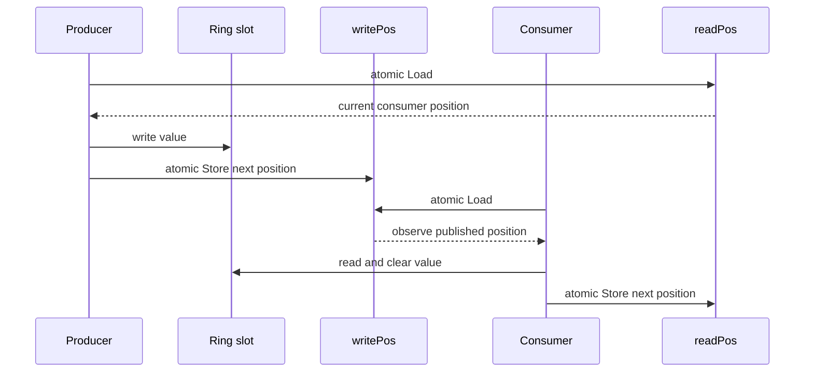

### 2.7 为什么位置之间有缓存行填充

`readPos` 主要由 Consumer 写，`writePos` 主要由 Producer 写。如果它们落在同一个 CPU Cache Line 上，那么任何一方写入位置都会使另一颗 CPU Core 上的整条缓存行失效，即使双方修改的是不同变量。这种现象叫 False Sharing。

实现用填充字段拉开两个计数器：

```go
_        [cacheLineSize]byte
readPos  atomic.Uint64
_        [cacheLineSize]byte
writePos atomic.Uint64
_        [cacheLineSize]byte
```

这样做是为了减少热点计数器之间的缓存一致性流量。`64` 是常见 CPU 的 Cache Line 大小，但不是 Go API 提供的跨平台常量，因此这仍是一种面向常见硬件的工程假设，而不是语言层面的保证。

### 2.8 使用边界

- 同一时间必须恰好只有一个 Producer 和一个 Consumer。
- `TryEnqueue` 在队列满时立即返回 `false`，`TryDequeue` 在队列空时立即返回 `false`；调用者需要决定重试、让出 CPU、等待通知还是丢弃数据。
- `Len` 是瞬时观测值，返回后可能立即过期，不能用它代替一次真正的入队或出队尝试。
- 队列创建后不能复制，否则会复制原子位置和 Slice Header，破坏单一状态的假设。
- Race Detector 可以发现实际发生的数据竞争，但不一定能证明调用者始终遵守 SPSC 角色约束。

相关资料：

- [The Go Memory Model](https://go.dev/ref/mem)
- [Package sync/atomic](https://pkg.go.dev/sync/atomic)

## 3. LockFreeQueue：Michael-Scott MPMC 队列

MPMC 实现使用带哨兵节点的单链表。理解它时先记住三个不变量：

- `head` 指向当前哨兵，`head.next` 才是第一个可出队的元素。
- 链表的 `next` 是队列内容的事实；`tail` 只是用于快速找到队尾的导航指针，允许暂时落后。
- 入队竞争发生在队尾节点的 `next` 上，出队竞争发生在 `head` 上；同一个 CAS 目标同时只能有一个成功者。

队列刚创建时，`head` 和 `tail` 都指向同一个 dummy 节点：

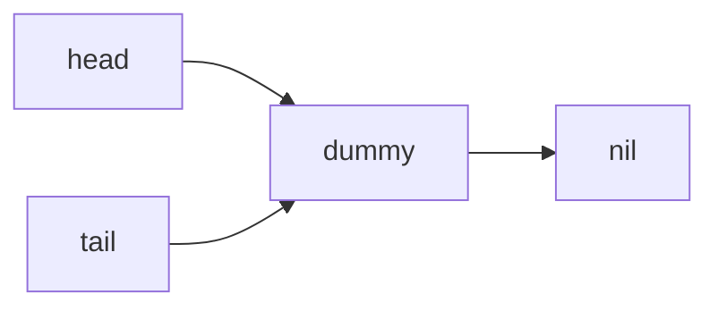

有三个元素时，指针关系如下：

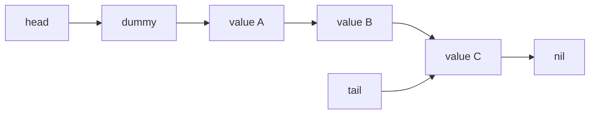

此时可以出队的是 `A`，不是 `dummy`。当 `A` 出队后，`head` 会移动到 `A`，`A` 随即成为新的哨兵。

### 3.1 没有竞争时如何入队

1. 读取 `tail` 和 `tail.next`。
2. 如果 `tail.next != nil`，说明另一个 Goroutine 已链接新节点但尚未推进 `tail`，当前 Goroutine帮助推进它。
3. 使用 CAS 将新节点从 `nil` 链接到 `tail.next`。
4. 尝试推进 `tail`。即使推进失败，入队也已经成功。

成功修改 `tail.next` 的 CAS 是入队的线性化点。

假设空队列入队 `A`，链表会经历两个变化：先链接节点，再推进 `tail`。

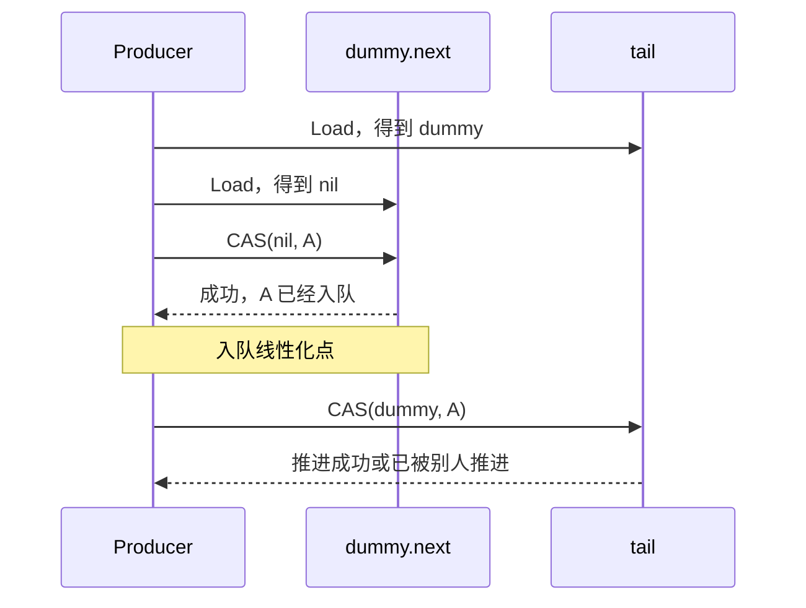

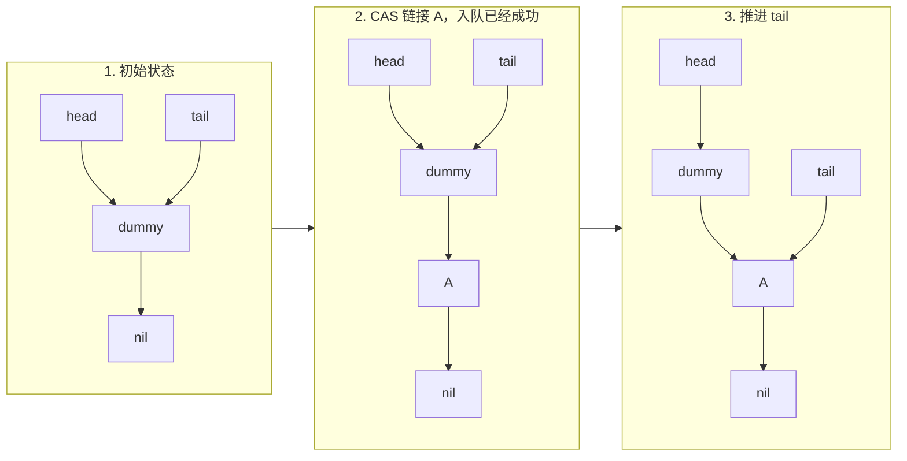

推进 `tail` 不是入队成功的条件。只要 `dummy.next` 已经从 `nil` 变成 `A`，其他 Goroutine 就能观察到并继续操作。

### 3.2 两个 Producer 同时入队

假设 P1 准备入队 `A`，P2 准备入队 `B`。两者都读到相同的旧队尾，都会尝试把 `dummy.next` 从 `nil` 改成自己的节点：

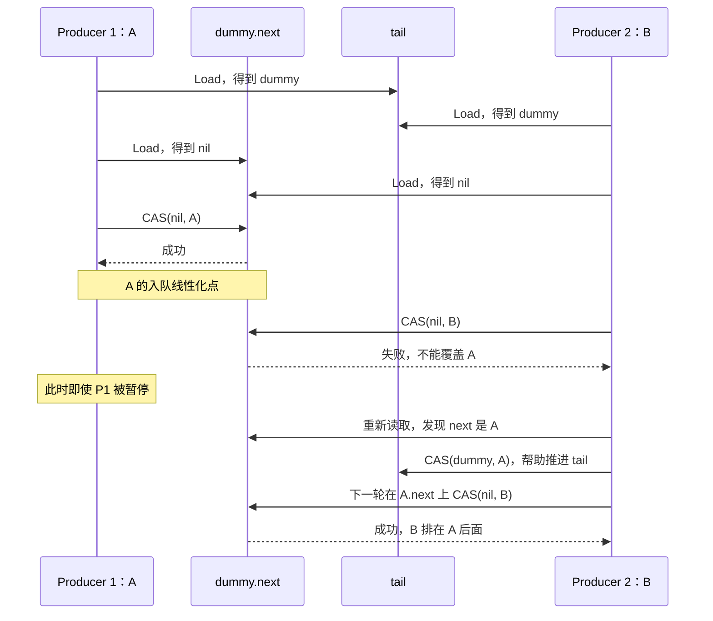

对应的链表状态是：

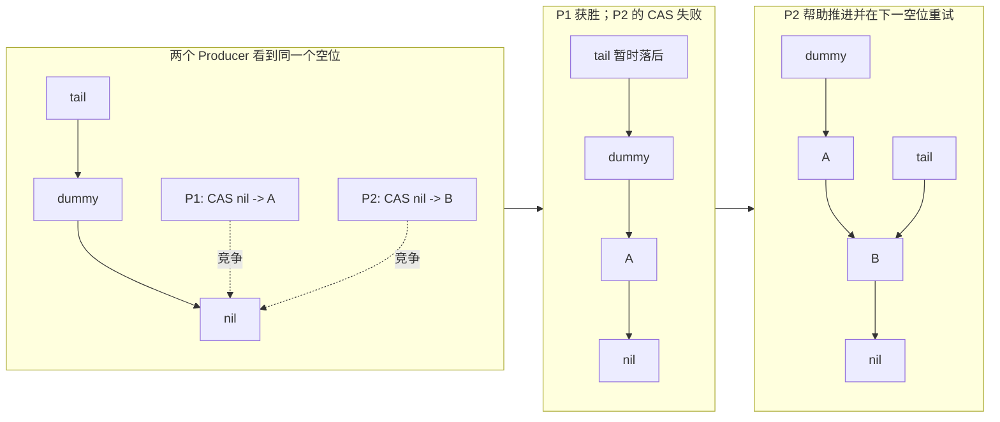

CAS 失败不代表队列停止前进，恰恰说明另一个 Producer 已经成功链接了节点。失败者重新读取链表，必要时帮助推进 `tail`，再竞争下一个 `nil`。

### 3.3 入队控制流程

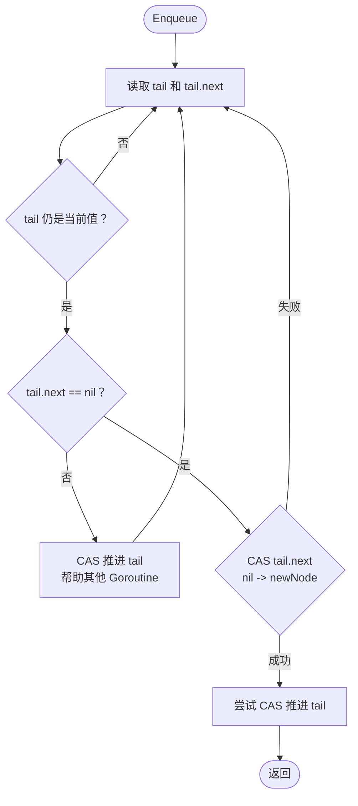

### 3.4 没有竞争时如何出队

1. 读取 `head`、`tail` 和 `head.next`。
2. `head.next == nil` 表示队列为空。
3. `head == tail` 但存在 `next`，说明 `tail` 落后，当前 Goroutine帮助推进它。
4. 使用 CAS 将 `head` 推进到 `next`；`next` 由此成为新的哨兵。

成功修改 `head` 的 CAS 是出队的线性化点。

假设队列包含 `A`、`B`，出队 `A` 时并不会删除 `A` 节点，而是把 `head` 从旧 dummy 推进到 `A`：

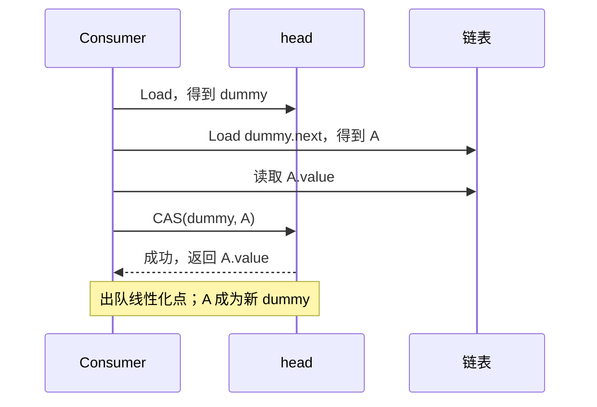

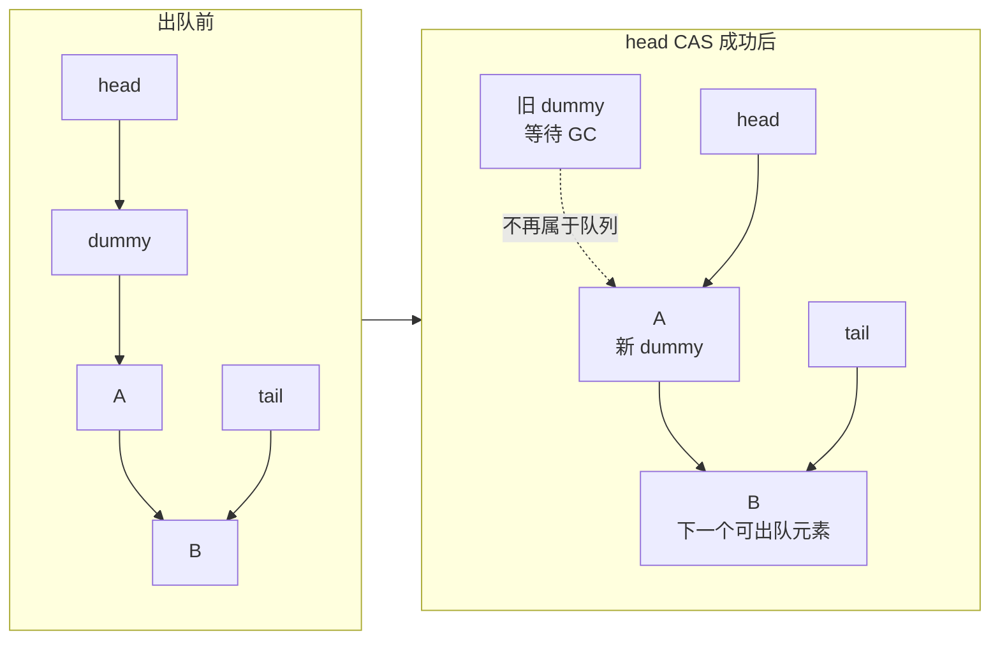

算法先读取 `A.value`，再竞争推进 `head`。只有 CAS 成功的 Consumer 才能返回这个值；CAS 失败者必须丢弃刚才读取的值并重试。

### 3.5 两个 Consumer 同时出队

假设 C1 和 C2 都读到了相同的 `head = dummy`、`next = A`：

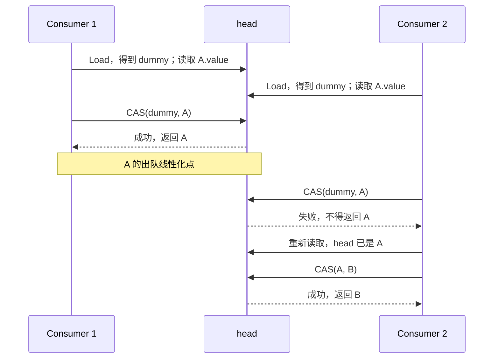

因此两个 Consumer 即使都提前读到了 `A.value`，也不可能都返回 `A`。推进 `head` 的 CAS 相当于对该元素的唯一认领操作。

### 3.6 Producer 尚未推进 tail 时遇到 Consumer

还有一种容易误判的中间状态：Producer 已把 `A` 链接到链表，但在推进 `tail` 之前被暂停。

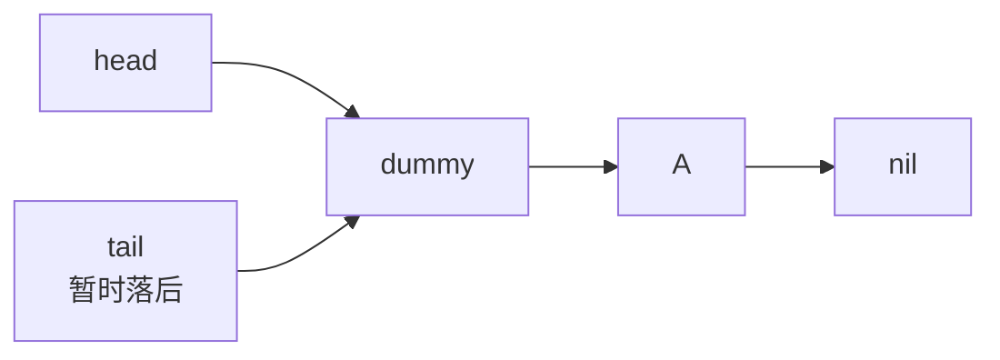

此时 `head == tail`，但 `head.next != nil`，所以队列并不为空。Consumer 会帮助 Producer 推进 `tail`，然后重新读取并正常出队：

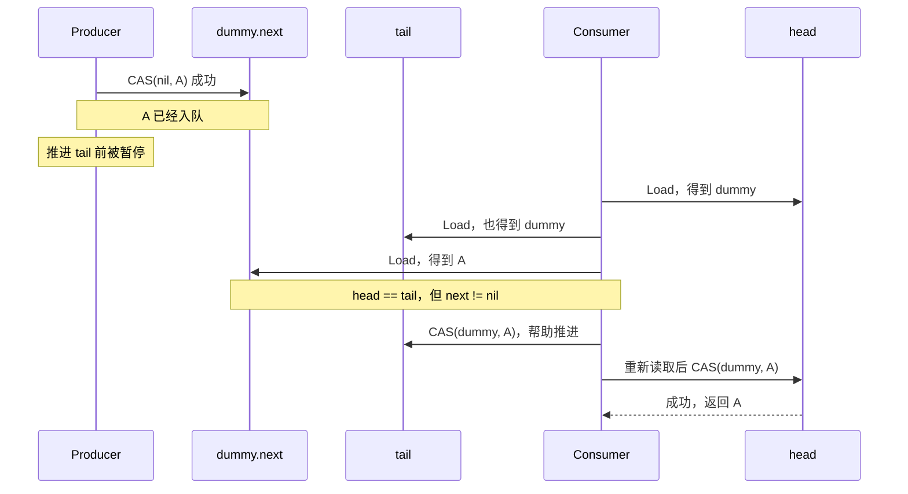

这解释了为什么出队代码必须区分两种情况：

| 观察结果 | 含义 | 动作 |
| -------- | ---- | ---- |
| `head.next == nil` | 链表中确实没有元素 | 返回空 |
| `head == tail && head.next != nil` | `tail` 落后 | 帮助推进 `tail` 后重试 |
| `head != tail && head.next != nil` | 存在可认领元素 | CAS 推进 `head` |

### 3.7 出队控制流程


### 3.8 竞态条件如何收敛

Michael-Scott Queue 没有消除竞争，而是把竞争集中到少数原子状态转换上：

| 竞态 | 唯一决定操作 | 失败者如何处理 |
| ---- | ------------ | -------------- |
| 多个 Producer 竞争同一个队尾空位 | `tail.next` 的 CAS | 重新读取，帮助推进 `tail`，再竞争下一个空位 |
| 多个 Consumer 竞争同一个元素 | `head` 的 CAS | 丢弃提前读取的值，重新读取新的 `head` |
| `tail` 落后于真实链表末尾 | 任意 Goroutine 推进 `tail` 的 CAS | 推进失败也无妨，说明别人已经推进 |
| 读取期间 `head` 或 `tail` 改变 | 再次 Load 验证快照 | 放弃旧快照并重试 |

可以把整个算法压缩成下面四句话：

```text
入队：竞争把队尾的 nil next 改成新节点。
出队：竞争把 head 从旧哨兵推进到下一个节点。
tail：允许落后，任何 Goroutine 都可以帮助推进。
CAS 失败：说明别的 Goroutine 已经取得进展，重新观察即可。
```

### 为什么 Go 版本不手工回收节点

C/C++ 无锁链表需要解决 hazard pointer、epoch reclamation 等内存回收问题，否则可能发生 use-after-free 和地址复用导致的 ABA。这个实现依靠 Go GC：只要某个 Goroutine 还持有节点指针，节点就不会被回收和复用。

这降低了教学复杂度，但不代表没有成本：每次入队都会分配节点，GC 压力可能使它输给有界环形队列或 Mutex 版本。

## 4. BlockingPriorityQueue：阻塞和关闭语义

优先队列基于 `container/heap`、`sync.Mutex` 和 `sync.Cond`：

- 数字更大的 Priority 先出队。
- 相同 Priority 按入队 Sequence 保持 FIFO。
- `Pop` 在空队列上等待，不使用忙轮询。
- `Close` 拒绝新 Push，唤醒所有等待者，并允许先排空已有元素。
- 关闭且排空后，`Pop` 返回 `ErrClosed`。

显式关闭很重要。没有关闭协议的阻塞结构会让 Worker 无法可靠退出，也容易在测试和服务停机时泄漏 Goroutine。

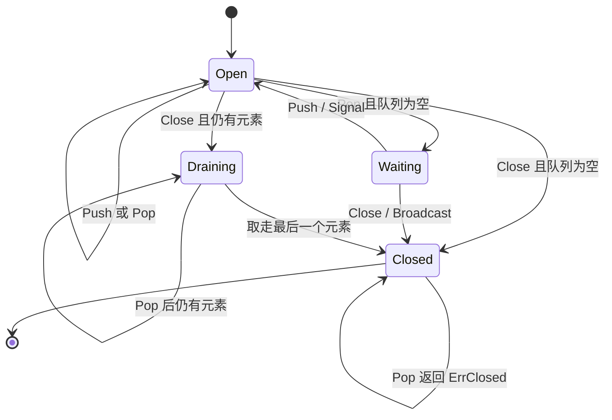

## Lock-free 到底意味着什么

Lock-free 不等于：

- 完全没有等待：单个 Goroutine 可能持续 CAS 失败而饥饿。
- Wait-free：本实验没有保证每个操作在有限步骤内完成。
- 一定更快：缓存一致性流量、分配、竞争和重试都可能抵消收益。
- 不需要测试：错误通常只在特定交错顺序下出现。

Lock-free 的含义是：系统整体持续取得进展。即使某个 Goroutine 被暂停，其他 Goroutine 仍有机会完成操作。

## 如何读测试

- `TestSPSCQueueFullEmptyAndWrapAround` 验证有界队列的满、空和下标环绕。
- `TestSPSCQueueConcurrentProducerAndConsumer` 验证单 Producer/Consumer 的顺序与可见性。
- `TestLockFreeQueueMultipleProducersAndConsumers` 使用唯一整数检测重复和丢失。
- Priority Queue 测试验证优先级、同优先级 FIFO、唤醒和关闭后排空。

并发测试只能增加发现错误的概率，不能形式化证明算法正确。深入学习时可以继续加入：

- 不同 `GOMAXPROCS` 和高重复次数测试。
- 随机操作序列与模型对比测试。
- Linearizability checker。
- CPU/Memory Profile 和 mutex/block profile。
- 不同 Producer/Consumer 比例下的吞吐与 P99 延迟基准。

## 基准注意事项

当前 Benchmark 是单 Goroutine 的入队/出队 Round Trip，用来观察基础开销，不代表高竞争性能。比较并发结构时必须固定：

- Producer/Consumer 数量和 CPU 亲和性。
- 队列容量、元素大小和预分配策略。
- 是否允许忙轮询以及可接受的 CPU 占用。
- 吞吐量之外的 P50/P99 延迟和分配次数。
- Go 版本、`GOMAXPROCS`、机器拓扑和测试时长。

不要从一次 `ns/op` 得出“无锁优于锁”的普遍结论。

## 延伸资料

- [The Go Memory Model](https://go.dev/ref/mem)
- [Package atomic](https://pkg.go.dev/sync/atomic)
- [Package container/heap](https://pkg.go.dev/container/heap)
- [Simple, Fast, and Practical Non-Blocking and Blocking Concurrent Queue Algorithms](https://www.cs.rochester.edu/research/synchronization/pseudocode/queues.html)
- [Go Data Race Detector](https://go.dev/doc/articles/race_detector)
